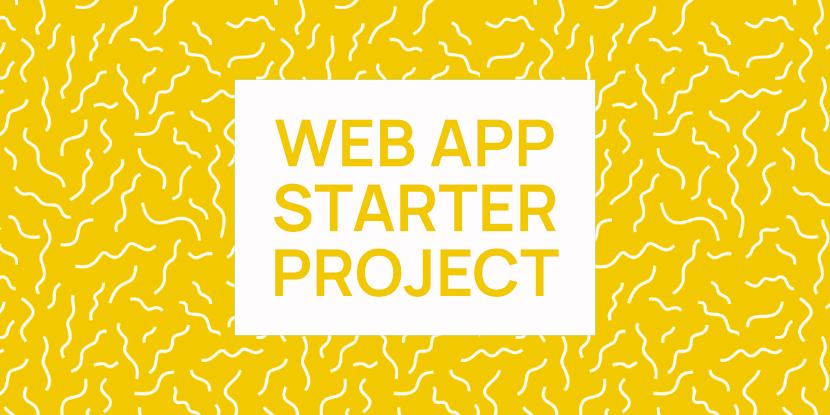

# Web App Starter Project

[](https://github.com/thinknathan/web-app-starter-project/actions/workflows/ci-desktop.yml) [](https://github.com/thinknathan/web-app-starter-project/actions/workflows/ci-android.yml)

Web App Starter Project is a starting point for web app development. Apps can be packaged for the web, Windows, macOS, Linux, or Android via [Github Actions](https://github.com/features/actions).

For development, WASP installs opinionated defaults in the form of [TypeScript](https://www.typescriptlang.org/) and [PostCSS](https://postcss.org/), but can be made to work with any [framework](https://developer.mozilla.org/en-US/docs/Learn/Tools_and_testing/Client-side_JavaScript_frameworks). Its focus is building for the web first. Non-browser APIs are only used to smooth over platform differences.

## Development features

### JavaScript

- [esbuild](https://esbuild.github.io/) for fast JavaScript bundling
  - TypeScript support
  - Live reload when TS changes
  - Simple multithreading with [promise-based Web Workers](https://www.npmjs.com/package/worker-async) that are [automatically inlined](https://github.com/mitschabaude/esbuild-plugin-inline-worker)
- [Eslint](https://eslint.org/) for error checking
- [Prettier](https://prettier.io/) for automatic formatting

### CSS

- PostCSS for CSS processing
  - [Hot reloading](https://esbuild.github.io/api/#hot-reloading-css) when CSS changes
  - [postcss-preset-env](https://github.com/csstools/postcss-plugins/blob/main/plugin-packs/postcss-preset-env) and [modern defaults](https://github.com/sindresorhus/modern-normalize) for cross-browser compatibility
  - [Mixins](https://github.com/postcss/postcss-mixins) for developer experience

### Export platforms

- [Progressive Web App](https://developer.mozilla.org/en-US/docs/Web/Progressive_web_apps) support with [Workbox](https://github.com/GoogleChrome/workbox) for generating a [Service Worker](https://developer.mozilla.org/en-US/docs/Web/API/Service_Worker_API)
- Github Action for generating an Android app via [Capacitor](https://github.com/ionic-team/capacitor)
- Github Action for generating an app for Windows / MacOS / Linux via [Electron](https://github.com/electron-userland/electron-builder)

## Getting started

### Requirements

- [Node.js](https://nodejs.org/en/download/)
- [Yarn package manager](https://yarnpkg.com/)
- Github account (if using Github Actions)

### Install

- `yarn` Installs main project dependencies

- Update these important fields in `package.json`:

  - `appId` A unique domain for your app, in reverse order. Eg. `www.example.com` becomes `com.example.www`
  - `name` A short, simple of your app without spaces
  - `productName` The name of your app in a less strict format that can support spaces
  - `description` Describe what your app does
  - `author` The creator of your app - presumably you
  - `version` The version of your app. [Semver](https://semver.org/) is encouraged

- (Optional) Update your app colours:

  - `meta name="theme-color"` in `www/index.html`
  - `theme_color` in `www/app.webmanifest`
  - `iconBackgroundColor` values in the `icon:mobile` scripts in `package.json`
  - `background` values in the `icon:web` scripts in `package.json`
  - `darkBackground` and `lightBackground` in `src-electron/main.ts`

- (Optional) Change the default window resolution in Electron:

  - Edit `width` and `height` in `src-electron/main.ts`

- (Optional) Generate your Capacitor project with `npx --no cap add android`

## Commands

- `yarn build` Builds the project
- `yarn build:desktop` Builds the project for distribution as an Electron app
- `yarn build:mobile` Builds TS and mobile app icons (Doesn't build the app files; you'll have to manually run `cap build android`)
- `yarn build:web` Builds the project for distribution on the web, builds icons, generates service worker

- `yarn dev` Watches for changes and serves to http://localhost:8000/
- `yarn dev:desktop` Launches project in Electron
- `yarn dev:web` Identical to `yarn dev` except it sets `TARGET_ENV` to `web`

- `yarn icon:desktop` Generates icons in Electron folders
- `yarn icon:mobile` Generates icons in Android folders
- `yarn icon:web` Generates icons and adds links to them in `index.html` and `app.webmanifest`

- `yarn lint` Checks for errors in Electron and web source TS
- `yarn lint:electron` Checks for errors in Electron source TS
- `yarn lint:www` Checks for errors in web source TS

- `yarn prettier` Applies formatting to source TS and CSS
- `yarn prettier:scripts` Applies formatting to source TS
- `yarn prettier:styles` Applies formatting to source CSS

- `yarn sw` Generates service worker
- `yarn sw:dev` Generates service worker in debug mode

## File structure

- `src-electron` (Used by Electron for generating a desktop app)
  - `buildResources` (Icons for Electron generated by `yarn icon:desktop`)
  - `main.ts` (Main entry point for Electron)
- `src-www` (Web source code)
  - `scripts`
    - `app.ts` (Main TypeScript source file for web)
  - `styles`
    - `app.css` (Main CSS source file for web)
  - `images`
    - `icon.svg` (Used to generate icons for Android and PWA. Keep in mind it may be masked in a circle, rounded square, etc.)
    - `icon-precomposed.svg` (Used to generate icons for Electron and web favicon)
    - `splash.svg` (Used to generate splash screen for Android and PWA)
- `www` (All production files)
  - `assets`
    - `fonts` (Font files can be added here manually)
    - `images`
      - `icons` (Generated by `yarn icon:web`)
    - `scripts` (Bundled JS)
    - `styles` (Bundled CSS)
  - `app.webmanifest` (Manifest for a Progressive Web App)
  - `index.html` (Main HTML file for the project)
- `build-electron.mjs` (esbuild script for bundling Electron assets)
- `build-www.mjs` (esbuild script for bundling web assets)

## Github Actions

These [Github Actions](https://github.com/features/actions) will automatically build your project for distribution on multiple platforms.

- Build Desktop `build-desktop.yml`
  - Produces Windows, MacOS and Linux builds
- Build Android `build-android.yml`
  - Produces Android builds in APK and AAB format

## Code signing

Code signing is enabled by default in the Github actions for Windows and Android apps. Signing macOS apps is outside the scope of this project, but you can set it up yourself. See [electron builder's docs](https://www.electron.build/code-signing).

Before you start, you may want to get familiar with adding secrets to your [Github project](https://docs.github.com/en/actions/security-guides/encrypted-secrets).

### Android code signing in Github Actions

The following is a simplified version of [Stanislav Khromov's article](https://dev.to/khromov/build-your-capacitor-android-app-bundle-using-github-actions-24do). If you don't already have a keystore for Android app signing, start by reading that article.

- Encode your keystore as a base64 string
- Upload your keystore (now a base64 string) as a secret called `RELEASE_KEYSTORE` in your Github repo
- Add your password as a secret called `RELEASE_KEYSTORE_PASSWORD`
- Add your alias as a secret called `RELEASE_KEYSTORE_ALIAS`
- Add your alias password as a secret called `RELEASE_KEYSTORE_ALIAS_PASSWORD`
- You may now run the `Build Android` Github Action

### Windows code signing in Github Actions

This process requires a `.p12` or `.pfx` certificate file. The following instruction uses `certutil`, which is part of Windows.

- Base64 encode the certificate using `certutil -encode certificate.pfx base64cert.txt` where `certificate.pfx` is the `.pfx` file and `base64cert.txt` is the output file
- Add the base64-encoded text as a secret called `CSC_LINK` in your Github repo
- Add the password to decrypt the cerificate as a secret called `CSC_KEY_PASSWORD` in your Github repo

#### Turning signing OFF

If you'd rather skip code signing for Windows, do the following:

- Edit `.electron-builder.config.js` to set `signAndEditExecutable` to `false`

## Export formats

This project generates unpacked directories by default. This format is suitable for uploading to distrbution platforms like [Itch](https://itch.io/docs/itch/integrating/compatibility-policy.html).

If you're not using a distribution platform that handles updates, you should set up [auto update in Electron](https://www.electron.build/auto-update.html) to ensure users of your app always have access to the latest and most secure version of your software.

If you'd like to generate simple executables that your audience downloads directly, here's what I recommend:

### Windows Portable `.exe`

Update your `.electron-builder.config.js`:

```
win: {
	target: ['portable'],
	signAndEditExecutable: true,
},
portable: {
	unpackDirName: true,
},
```

#### Slow app start

Portable apps have to extract their files from a compressed archive before they can start, and this process takes around 10 seconds.

You can choose to add a splash screen to the portable app, so the user sees something while the app is unpacking. Your splash file should be the BMP format.

Update the `.electron-builder.config.js` file so it contains a path to your splash image:

```
portable: {
	splashImage: 'src-electron/buildResources/splash.bmp',
	unpackDirName: true,
},
```

### macOS `.dmg`

Update your `.electron-builder.config.js`:

```
mac: {
	target: {
		target: 'dmg',
		arch: 'universal',
	},
	darkModeSupport: true,
},
```

### Linux `.flatpak`, `.AppImage` and `.snap`

Update your `.electron-builder.config.js`:

```
linux: {
	target: ['AppImage', 'flatpak', 'snap'],
	// https://specifications.freedesktop.org/menu-spec/latest/apa.html#main-category-registry
	category: 'Game',
},
snap: {
	allowNativeWayland: true,
},
flatpak: {
	useWaylandFlags: true,
},
```

#### Flatpak

Building Flatpaks on Ubuntu requires [extra dependencies](https://github.com/electron/forge/issues/2561#issuecomment-1425107777).

The default Github Action will fail when trying to build a Flatpak due to these missing dependencies. Add in an extra step after `Setup NodeJS`:

```
- name: (Ubuntu) Install Flatpak dependencies
	if: matrix.os == 'ubuntu-latest'
	run: |
		sudo apt-get install -y flatpak flatpak-builder elfutils
		flatpak remote-add --if-not-exists --user flathub https://flathub.org/repo/flathub.flatpakrepo
		git config --global --add protocol.file.allow always
```

## License

You may choose to use this software under either of the following licenses, at your option:

- [GNU General Public License Version 3.0](LICENSE), or any later version
- [Mozilla Public License 2.0](LICENSE-MPL-2.0)

## Your contributions

Unless you explicitly state otherwise, any contribution intentionally submitted for inclusion in the work by you shall be dual licensed as above, without any additional terms or conditions.

## Thanks

- Electron team for [electron-quick-start](https://github.com/electron/electron-quick-start)
- reZach for [secure-electron-template](https://github.com/reZach/secure-electron-template)
- Vadim for [Making Electron apps feel native on Mac](https://getlotus.app/21-making-electron-apps-feel-native-on-mac)
